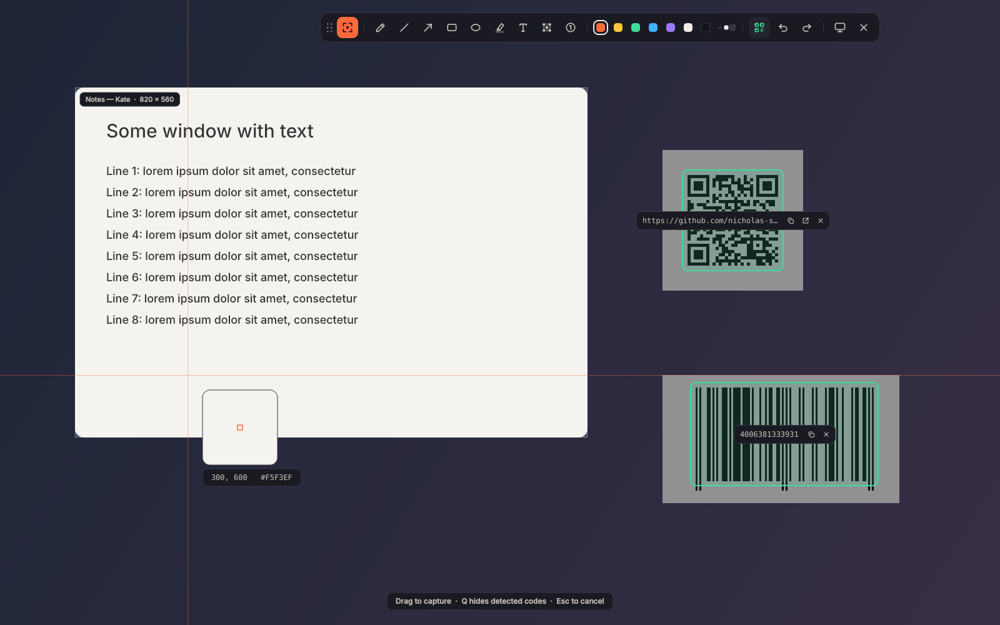
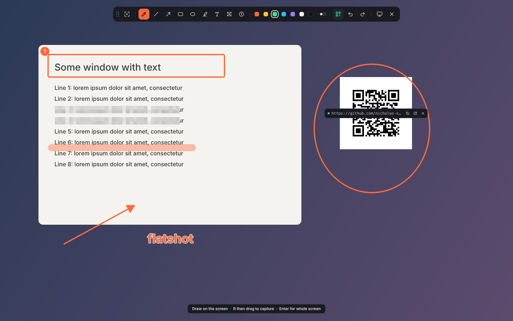
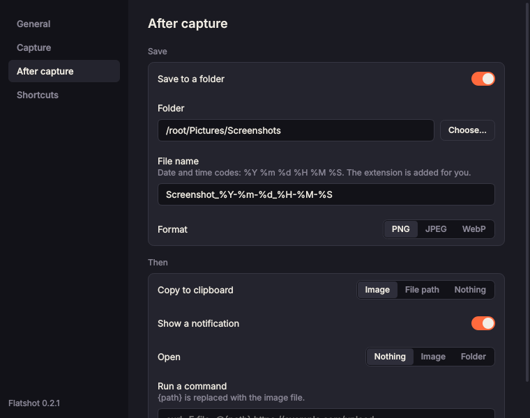

# Flatshot

A small ShareX-style screenshot tool for Linux on Wayland, built mainly for KDE Plasma.

Flatshot lives in your system tray. Press your shortcut and the screen freezes. **Drag a region, or click a window, and it's saved and copied straight away.** If you want to mark it up first, use the floating toolbar to draw on the frozen screen, then drag. Any **QR codes and barcodes** on screen are found automatically, each with a small card for copying or opening it. The toolbar's record button **records an area of the screen** to MP4, WebM or GIF.

The app is native Qt, but every pixel is custom-painted. It ignores your Qt style, colour scheme, fonts and icon theme, so it looks the same on every desktop: flat, square with rounded corners. Pick one of five colour themes in settings: Ember (the default), Graphite, Nord, Dusk or the light Paper.

| | |
|---|---|
|  |  |
| Capture mode: click a window or drag a region | Draw mode: mark up first, then drag |
|  | |
| Settings | |

## Features

- **Instant region capture**: drag and release to save to `~/Pictures/Screenshots` and copy to the clipboard.
- **Window capture** (KDE): hover over where a window was when the screen freezes and it lights up; click to capture just that window. Clicking empty desktop captures the whole monitor.
- **Instant captures, no selection needed**: the **active window**, the **current monitor** (the one under the pointer), **all screens**, or the **last region** you captured, each on its own shortcut. From scripts you can also capture an exact area with `--region WxH+X+Y`. Active-window capture works on KDE Plasma, Sway and Hyprland.
- **Pin to screen**: keep a capture in view as a small always-on-top window. Turn on the toolbar's pin button (or press <kbd>K</kbd>) and your next drag or window click is pinned instead of saved. It still captures the moment you let go; nothing asks first. There's also a "Pin region" shortcut, `--pin`, and a **Pin** button on notifications. Drag a pin to move it, scroll to zoom, double-click or <kbd>Esc</kbd> to close, right-click to copy or save.
- **Tray app with global shortcuts**: Flatshot registers with KDE's shortcut service. You set the keys in Flatshot's settings, or in System Settings → Shortcuts → Flatshot. Defaults are <kbd>Ctrl</kbd>+<kbd>Print</kbd> (region), <kbd>Ctrl</kbd>+<kbd>Alt</kbd>+<kbd>Print</kbd> (active window) and <kbd>Ctrl</kbd>+<kbd>Shift</kbd>+<kbd>Print</kbd> (all screens). Current monitor, last region, pin and record screen have no default key; set one if you want it.
- **Folder and file name templates**: build the path from the date, the window's app or title, the capture type, the size or a counter. For example, `~/Pictures/Screenshots/%Y-%m/{app}` sorts shots into a folder per month and app.
- **Save as PNG, JPEG, WebP, AVIF or JPEG XL**, with a quality slider for the lossy formats. WebP, AVIF and JPEG XL appear when Qt has the plugins: `qt6-imageformats` and `kimageformats`.
- **After-capture actions** you choose in settings: save to a folder, copy the image or its path, show a notification, open the image or folder, or run your own command (for example an upload script).
- **Mouse pointer** can be included in instant captures (off by default). When picking a region it's left out, unless **Settings → Capture → Mouse pointer when selecting** says **Always**, or **Your choice**: then the toolbar's pointer button (or <kbd>M</kbd>) shows or hides it in the frozen picture and the capture. Your choice takes two screenshots at once (KWin's helper or grim), so the overlay takes a little longer to open.
- **Capture sound** (off by default): plays the desktop's screenshot sound, or a file you choose, after each capture. It uses an audio player you already have (`pw-play`, `paplay`, `ffplay` or `canberra-gtk-play`), runs in the background and never delays the capture.
- **Notifications** show a thumbnail of the capture with **Open**, **Show in folder**, **Annotate** and **Pin** buttons. **Pin** opens the pin where the screenshot was taken (unless your monitors have changed since).
- **Annotation editor**: **Annotate** (on a notification, in the tray menu, or `flatshot -i image.png`) opens the picture in a window of its own with the same drawing tools, colours and sizes as the toolbar, undo and redo, and **Copy**, **Save as** and **Save** (back to the file; it's highlighted while there are unsaved changes, and the title starts with ●). Scroll to move around, <kbd>Ctrl</kbd>+scroll to zoom (pinch on a touchpad), hold <kbd>Space</kbd> or the middle button and drag to pan, <kbd>Ctrl</kbd>+<kbd>0</kbd> fits the picture in the window. Drawings past the picture's edges aren't shown, since they wouldn't be saved. Undo and redo are greyed out when there's nothing to undo or redo, and **Copy** says **Copied** for a moment. **Save as** opens your desktop's own file dialog (KDE's on Plasma, through the XDG portal), falling back to Qt's where there's no portal. Open as many as you like; closing one with unsaved changes asks first, inside the window: **Don't save**, **Cancel** or **Save** (<kbd>Enter</kbd> saves, <kbd>Esc</kbd> cancels).
- **No window animations on KDE**: like Spectacle, the overlay is a layer-shell surface, so it appears and disappears instantly. This works with the native packages; see the known limitations below.
- **Screen recording**: pick the toolbar's record button (or press <kbd>V</kbd>), then drag an area, click a window, or press <kbd>Enter</kbd> for the whole screen. Drag the edges to adjust it. Under the area you can turn the **microphone**, the **computer's sound** and the **mouse pointer** on or off, and choose **MP4, WebM or GIF** and **24, 30 or 60 fps**; Flatshot remembers these. Press **Record** or <kbd>Enter</kbd>, and after a short countdown a small bar outside the area shows the time, with **pause**, **stop** and **discard**. The finished video goes to `~/Videos/Screencasts`, the file is copied to the clipboard, and a system notification offers **Open** and **Show in folder**. While recording, the tray icon turns into a stop button; clicking it, or pressing the "Record screen" shortcut again, stops and saves.
- **Floating toolbar** that appears on the monitor your mouse is on, and that you can drag anywhere by its grip. Tools: pen, line, arrow, rectangle, filled rectangle, ellipse, highlighter, text, pixelate and blur (for hiding secrets) and numbered counters. It has 7 colours plus one of your own, 3 stroke sizes, and undo/redo (greyed out when there's nothing to undo or redo).
- **Shapes as in Krita**: while dragging out a line, arrow, rectangle, ellipse, pixelate or blur, hold <kbd>Shift</kbd> to make it square (lines snap to 45°), <kbd>Ctrl</kbd> to draw it out from its middle instead of a corner, and <kbd>Alt</kbd> to move it around at its size without letting go; let go of <kbd>Alt</kbd> and it carries on growing from there.
- **Text you can edit**: click to type; the caret moves with the arrows, <kbd>Home</kbd> / <kbd>End</kbd> and <kbd>Ctrl</kbd> for whole words, <kbd>Shift</kbd> selects, <kbd>Ctrl</kbd>+<kbd>A</kbd> / <kbd>X</kbd> / <kbd>C</kbd> / <kbd>V</kbd> work, <kbd>Ctrl</kbd>+<kbd>Z</kbd> undoes typing, and input methods (compose, dead keys, CJK) work. <kbd>Shift</kbd>+<kbd>Enter</kbd> starts a new line, <kbd>Enter</kbd> or <kbd>Esc</kbd> finishes. Click text you've placed to change it, or drag it to move it; undo brings back what it was. Picking a colour while capturing (or pixelating or blurring) switches back to the drawing tool you used last, so the colour gets used.
- **Your own colour**: the eighth swatch (ringed in a rainbow) opens a picker under the toolbar: a square of shades, a hue bar, a hex field you can type into, and an eyedropper that takes any pixel on the screen. Your colour is remembered.
- **Snap to edges**: turn on the toolbar's magnet (or press <kbd>G</kbd>) and a selection's corners jump to edges in the picture as you drag, boxes first: long straight edges win over text, and a box's corner (two edges meeting) over a line that just passes by. Boxes with rounded corners count too: near one, the corner goes to where the box's sides would meet. The magnifier shows the pixel grid and two lines where the selection's edges go, which jump to the edge they snap to. Hold <kbd>Ctrl</kbd> to place a corner freely. How close you must be and how faint an edge may be are settings. It's remembered between captures, and when it's off it costs nothing.
- **Across monitors**: a drag can run from one monitor onto another, and clicking a window that spans monitors captures all of it (it's highlighted on each). Drawings on every monitor are kept. The toolbar stays on one monitor. A recording area can cross monitors too: on KDE share the **full workspace** when asked (it's remembered), and on X11 it just works; with wf-recorder (Sway, Hyprland) it stays on one monitor. On by default.
- **QR codes and barcodes** (QR, Data Matrix, Aztec, PDF417, EAN/UPC, Code 128 and more, via zxing-cpp or zbar) are outlined in mint. Each gets a slim card with the decoded text and buttons to copy it, open it (for links) or dismiss it. Cards never cover one another, and hovering a code or its card brings it to the front. <kbd>Q</kbd> or the toolbar's code button hides or shows them all, and that's remembered for next time; codes you dismissed stay dismissed.
- **Adjustable screen shading**, including off.
- A **magnifier** shows pixel coordinates and the hex colour under the cursor; press <kbd>I</kbd> to copy that colour. Its square stays visible on any colour. It and the crosshair are there as soon as the overlay opens, before the mouse moves. You can resize it (80–320 px) or turn it off, and turn off the crosshair lines too; they keep following the pointer over the toolbar. The **Rainbow** setting makes the crosshair and the square cycle through the colours. A size label shows the selection's real pixel size.
- **Multi-monitor and HiDPI aware.** Output is saved at full native resolution with annotations drawn in at that resolution.

## Install

Grab a package from the [latest release](https://github.com/nicholas-sbx/screenshot/releases/latest):

| Distro | File | Install |
|---|---|---|
| Any (self-contained) | `Flatshot-*-x86_64.AppImage` | `chmod +x Flatshot-*.AppImage && ./Flatshot-*.AppImage` |
| Debian 12+, Ubuntu 24.04+, KDE neon | `flatshot_*_amd64.deb` | `sudo apt install ./flatshot_*_amd64.deb` |
| Fedora / openSUSE | `flatshot-*.x86_64.rpm` | `sudo dnf install ./flatshot-*.x86_64.rpm` |
| Arch / Manjaro / EndeavourOS | `flatshot-*-x86_64.pkg.tar.zst` | `sudo pacman -U flatshot-*-x86_64.pkg.tar.zst`, or use the pacman repo below |

The native packages use your distro's **PyQt6**. The AppImage bundles Python, **PySide6** and zxing-cpp. You can also install from source with `pipx install .`.

### Arch: pacman repository

Each release also publishes a pacman repository. Add it once, and Flatshot updates with the rest of your system.

1. Add the repository to the end of `/etc/pacman.conf`:

   ```sh
   sudo tee -a /etc/pacman.conf <<'EOF'

   [flatshot]
   SigLevel = Optional TrustAll
   Server = https://github.com/nicholas-sbx/screenshot/releases/download/pacman
   EOF
   ```

2. Refresh the package lists and install Flatshot:

   ```sh
   sudo pacman -Sy flatshot
   ```

3. From then on, `sudo pacman -Syu` picks up new Flatshot versions along with everything else.

To remove the repository, delete the `[flatshot]` block from `/etc/pacman.conf`. You can then uninstall Flatshot with `sudo pacman -R flatshot`.

Notes:

- **The GitHub repository must be public for this to work.** The repository is hosted as a GitHub release, and pacman can't sign in to download from a private one.
- **The packages aren't signed yet**, hence `SigLevel = Optional TrustAll`.
- **AVIF and JPEG XL saving:** install `qt6-imageformats` and `kimageformats` (KDE Plasma already includes the latter). PNG and JPEG always work.

**QR codes and barcodes** need one of two scanners:

- **zxing-cpp** (`python3-zxing-cpp`; bundled in the AppImage) reads every format.
- **zbar** reads QR codes and the common 1D barcodes. It's in every distro's main repositories (`zbar` on Arch, `libzbar0` on Debian/Ubuntu, `zbar-libs` on Fedora) and needs no Python package. The Arch package depends on it.

Flatshot uses zxing-cpp when it's installed and zbar otherwise.

**Runtime helpers.** On Wayland an app can't read the screen itself, so Flatshot asks a trusted tool:

- **KDE Plasma**: `flatshot-kwin-grab`, a small native helper included in the `.deb`, `.rpm` and Arch packages. It reads raw pixels straight from KWin's screenshot API, taking tens of milliseconds. The tray app keeps it running, and KWin writes the pixels straight into Flatshot's memory, so a capture starts no process and copies the picture as little as it can (`flatshot -v` shows the time). KWin authorizes it through its own desktop file, so the permission covers that one binary only. If it isn't available (for example in the AppImage), Flatshot falls back to `spectacle`, which is noticeably slower because it starts a whole app and round-trips a PNG.
- **Sway, Hyprland, other wlroots compositors**: `grim`
- **GNOME**: `gnome-screenshot`
- **X11**: built in

**Screen recording** uses:

- **KDE Plasma, GNOME and other Wayland desktops**: the desktop's screen-cast portal, recorded with GStreamer. Install `gst-launch-1.0` and the PipeWire plugin, plus an encoder: `x264enc` or `openh264enc` for MP4, `vp8enc` for WebM. On Debian and Ubuntu that's `gstreamer1.0-tools gstreamer1.0-pipewire gstreamer1.0-plugins-good gstreamer1.0-plugins-ugly` (the `.deb` recommends them); on Arch, `gstreamer gst-plugin-pipewire gst-plugins-good gst-plugins-ugly`. The first time, the desktop asks which screen to share; after that Flatshot remembers it, per monitor, until you revoke it.
- **Sway, Hyprland, other wlroots compositors**: `wf-recorder` when installed, else the portal as above.
- **X11**: `ffmpeg`.
- **Everywhere**: `ffmpeg` for pausing (each stretch is recorded separately and joined at the end) and for GIFs. Without it the pause button and GIF are unavailable.

Settings → Recording, and `flatshot --diagnose`, show which recorder is in use and what's missing.

`wl-clipboard` is recommended. Without it, a clipboard image copied by a one-off `flatshot` run only lasts while that process runs, unless Klipper grabs it first. The tray app keeps running, so it doesn't have this problem.

### Getting started (KDE)

1. Start **Flatshot** from the app menu. This runs `flatshot --tray`, and the icon appears in the system tray.
2. Right-click the tray icon, choose **Settings…**, click a shortcut field and press your keys. You can also enable **Start at login** there.
3. To use <kbd>Print</kbd>, first free it from Spectacle under **System Settings → Shortcuts → Spectacle**. Flatshot tells you when a key is already taken, and by what.

On other desktops, the tray, settings and notifications work the same. For a key, bind the command `flatshot` in your desktop's keyboard settings; it hands the capture to the running tray app instantly.

## Using it

| | |
|---|---|
| Drag | capture region (saved and copied) |
| Click | capture the highlighted window, or the whole monitor |
| <kbd>Q</kbd> | hide / show detected QR codes and barcodes |
| <kbd>I</kbd> | copy the colour under the cursor (as `#RRGGBB`) and close |
| <kbd>K</kbd> | pin instead of save: the next drag or click pins the capture to the screen (press again to turn off) |
| <kbd>G</kbd> | snap selections to edges in the picture on / off (hold <kbd>Ctrl</kbd> while dragging to place freely) |
| <kbd>Enter</kbd> / <kbd>Ctrl</kbd>+<kbd>S</kbd> / <kbd>Ctrl</kbd>+<kbd>C</kbd> | capture whole monitor with your drawings |
| <kbd>Esc</kbd> / right-click | cancel the current drag, or quit (Esc acts when released, so the window underneath never gets it) |
| <kbd>R</kbd> | region tool (back to capture mode) |
| <kbd>V</kbd> | record tool: drag an area or click a window, then <kbd>Enter</kbd> to start (<kbd>Enter</kbd> before choosing picks the whole screen; <kbd>Esc</kbd> goes back) |
| <kbd>M</kbd> | show or hide the mouse pointer in the picture (and the capture) |
| <kbd>P</kbd> <kbd>L</kbd> <kbd>A</kbd> <kbd>B</kbd> <kbd>F</kbd> <kbd>E</kbd> <kbd>H</kbd> <kbd>T</kbd> <kbd>X</kbd> <kbd>U</kbd> <kbd>N</kbd> | pen, line, arrow, box, filled box, ellipse, highlighter, text, pixelate, blur, counter |
| <kbd>Shift</kbd> while drawing | snap lines to 45° and make boxes/ellipses square/round |
| <kbd>Ctrl</kbd> while drawing | draw the shape out from its middle |
| <kbd>Alt</kbd> while drawing | move the shape without changing its size |
| <kbd>1</kbd>–<kbd>7</kbd>, <kbd>8</kbd> | colour, your own colour |
| <kbd>[</kbd> <kbd>]</kbd> | stroke size |
| <kbd>Ctrl</kbd>+<kbd>Z</kbd> / <kbd>Ctrl</kbd>+<kbd>Shift</kbd>+<kbd>Z</kbd> | undo / redo |

All of these keys (but <kbd>Esc</kbd>, <kbd>Enter</kbd> and <kbd>Ctrl</kbd>+<kbd>S</kbd> / <kbd>C</kbd> to capture) can be changed under **Settings → Shortcuts → Keys in Flatshot**, separately from the global shortcuts. So can the annotation editor's: save <kbd>Ctrl</kbd>+<kbd>S</kbd>, save as <kbd>Ctrl</kbd>+<kbd>Shift</kbd>+<kbd>S</kbd>, copy <kbd>Ctrl</kbd>+<kbd>C</kbd>, fit <kbd>Ctrl</kbd>+<kbd>0</kbd>, actual size <kbd>Ctrl</kbd>+<kbd>1</kbd>, zoom <kbd>Ctrl</kbd>+<kbd>=</kbd> / <kbd>-</kbd>, close <kbd>Ctrl</kbd>+<kbd>W</kbd>.

Command line options:

```
flatshot --tray          # run in the system tray (global shortcuts, notifications)
flatshot                 # capture with the overlay (uses the tray app if it is running)
flatshot --full          # capture every screen immediately, no UI
flatshot --window        # capture the active window, no UI
flatshot --monitor       # capture the monitor under the pointer, no UI
flatshot --last-region   # capture the same area as last time, no UI
flatshot --region 800x600+100+50   # capture this area (logical pixels), no UI
flatshot --pin           # pick a region and pin it to the screen (combines with the above)
flatshot --record        # pick an area and record it; while recording, stops and saves
flatshot --settings      # open settings
flatshot --quit          # stop the tray app
flatshot --diagnose      # what this Flatshot and the running tray app use
flatshot -v              # say on stderr how long each step takes: screenshot, overlay, codes, saving, copying
flatshot --tray -v       # the same for every capture the tray app takes (quit a running one first)
flatshot --delay 3       # wait 3 s first
flatshot -o shot.png     # save to a specific file (the extension picks the format)
flatshot -f -o - > a.png # write PNG to stdout
flatshot -i image.png    # open an image in the annotation editor
flatshot --no-copy / --no-save / --no-scan
```

The saved path (or the decoded code text, or the picked colour) is printed to stdout, which makes it easy to use in scripts. Instant captures and `--pin` are handed to the tray app when it runs, like plain `flatshot`.

## Configuration

Everything is in the settings window. It's stored in `~/.config/flatshot/config.json`; every key is optional, and these are the defaults:

```json
{
  "save_to_disk": true,
  "save_dir": "~/Pictures/Screenshots",
  "filename": "Screenshot_%Y-%m-%d_%H-%M-%S",
  "format": "png",
  "quality": 90,
  "clipboard": "image",
  "notify": true,
  "open_after": "none",
  "run_command": "",
  "sound": false,
  "sound_file": "",
  "dim_opacity": 60,
  "show_loupe": true,
  "loupe_size": 120,
  "show_crosshair": true,
  "show_hint": true,
  "rainbow": false,
  "snap_edges": false,
  "snap_distance": 10,
  "snap_sensitivity": 5,
  "span_monitors": true,
  "detect_windows": true,
  "scan_codes": true,
  "show_codes": true,
  "toolbar_follows_mouse": true,
  "backend": "auto",
  "include_pointer": false,
  "theme": "ember",
  "default_tool": "region",
  "default_color": 0,
  "custom_color": "#FF4FA3",
  "keys": {},
  "default_size": 1,
  "record_dir": "~/Videos/Screencasts",
  "record_filename": "Recording_%Y-%m-%d_%H-%M-%S",
  "record_format": "mp4",
  "record_fps": 30,
  "record_mic": false,
  "record_system_audio": false,
  "record_cursor": true,
  "record_countdown": 3
}
```

- `format`: `png`, `jpg`, `webp`, `avif` or `jxl`. `quality` (1–100) applies to the lossy formats, and the file extension follows the format.
- `clipboard`: `image`, `path` or `none`.
- `open_after`: `none`, `image` or `folder`.
- `save_dir` and `filename` are templates. Both take strftime codes (`%Y` year, `%m` month, `%d` day, `%H-%M-%S` time, ...) and these tokens:

  | Token | Value |
  |---|---|
  | `{app}` | the captured window's app (like `firefox` or `org.kde.dolphin`). For other captures, the app that was active, when Flatshot can tell. |
  | `{title}` | that window's title |
  | `{mode}` | `region`, `window`, `monitor` or `desktop` |
  | `{monitor}` | the monitor's name, like `DP-1` |
  | `{w}`, `{h}` | the image size in pixels |
  | `{n}` | a counter that goes up with every capture that uses it. `{n:4}` pads it to `0001` |

  For a literal `%`, `{` or `}` in a folder or file name, write `%%`, `{{` or `}}`. Settings shows an example path as you type.

  A `/` in `filename` makes subfolders. Slashes, control characters and leading dots are removed from token values, so a window title can never point outside the folder. The extension is added from `format`. `{app}` and `{title}` are known on KDE Plasma, Sway and Hyprland.
- `sound`: play a sound after each capture. `sound_file` is the file to play; empty means the desktop's screenshot sound.
- `show_loupe`, `loupe_size` (80–320, in logical pixels) and `show_crosshair`: the magnifier and the crosshair lines while selecting. Scroll while selecting to zoom the magnifier in or out. `rainbow` cycles their colour. `show_hint` shows what to do next in the middle of the screen (it fades while the pointer is near).
- `snap_edges`: selections snap to edges in the picture (the toolbar's magnet, <kbd>G</kbd>). `snap_distance` (2–40 px) is how close the pointer must be to an edge; `snap_sensitivity` (1–10) how faint and short an edge may be and still count.
- `span_monitors`: a selection or a clicked window may cross monitors.
- `include_pointer`: draw the mouse pointer into instant captures (active window, monitor, all screens, last region).
- `run_command`: a shell command. `{path}` is replaced with the quoted image path, which is also available as `$FLATSHOT_PATH`.
- `backend`: `auto`, `kwin`, `spectacle`, `grim`, `gnome-screenshot` or `qt`.
- `record_dir` and `record_filename`: where recordings go, with the same codes as `save_dir` and `filename`. `record_format` is `mp4`, `webm` or `gif`; `record_fps` is `24`, `30` or `60`. `record_mic`, `record_system_audio` and `record_cursor` are the switches under the area (a GIF has no sound). `record_countdown` is in seconds (0–10, 0 for none). After a recording, `clipboard` (`image` copies the video file), `notify`, `open_after` and `run_command` apply as for screenshots.
- `theme`: `ember`, `graphite`, `nord`, `dusk` or `paper`. It changes the app's own panels only; drawing colours and what's saved stay the same.
- `keys`: the keys in Flatshot's own windows you changed, as `{"tool.pen": "J"}` (`""` for none); the names are in `flatshot/keys.py`. Settings → Shortcuts sets them.
- `custom_color`: your own drawing colour (`#RRGGBB`), the toolbar's eighth; the picker sets it. `default_color` 7 starts with it.

`flatshot --print-config` prints the settings in effect. Global shortcuts are stored by KDE itself, not in this file. The last region, the `{n}` counter and the screen-cast portal's restore tokens are kept in `~/.local/state/flatshot/state.json`.

## Default palette: "Ember"

| | | |
|---|---|---|
| Ink `#121218` | Base `#1A1A22` | Raised `#24242E` |
| Line `#363642` | Text `#F2EEE6` | Muted `#8B8898` |
| **Accent** `#FF6A3D` | **Codes** `#3DDC97` | |

Drawing colours: ember `#FF6A3D`, amber `#FFC53D`, mint `#3DDC97`, sky `#3DB2FF`, violet `#9B7BFF`, bone `#F2EEE6`, ink `#121218`.

## Development

```sh
python3 -m venv .venv && .venv/bin/pip install -e .
.venv/bin/flatshot -i some-image.png        # try the UI without capturing
QT_QPA_PLATFORM=offscreen FLATSHOT_SELFTEST_OUT=shots .venv/bin/flatshot --self-test
```

The self-test builds a fake desktop with a QR code in it. It then exercises, without a display:

- the overlay, scanner, window hit-testing and code show/hide/dismiss
- the instant modes (window, monitor, all screens, last region, `--region`), file name templates, pinning and the colour picker
- every drawing tool and the keyboard handling
- the capture pipeline and the settings window
- the record tool (choosing and adjusting an area, the options, the countdown) and a real recording of ffmpeg's test pattern with pause, stop and discard, when `ffmpeg` is installed

CI runs the self-test on PySide6 and on Ubuntu's PyQt6, offscreen and under a headless Weston (real Wayland), and again inside each built package. It also runs:

- `tests/desktop_services.sh` against KDE's real shortcut daemon (`kglobalaccel`) and a notification server. This covers registering, assigning, conflict detection and key presses, notification buttons, and a full tray run. It also covers the KWin capture helper, against a stand-in for KWin's screenshot service, and the screen-cast portal client against a stand-in portal.
- A layer-shell check on a headless Sway.

Building packages locally:

```sh
./packaging/build-packages.sh    # needs nfpm, cc, libdbus-1 headers → dist/*.deb *.rpm *.pkg.tar.zst
./packaging/build-appimage.sh    # needs curl → dist/Flatshot-*-x86_64.AppImage
```

## Releasing

CI runs only for release commits. To release:

1. Bump `__version__` in `flatshot/__init__.py`.
2. Push to `main`.

The `build` workflow then:

1. Runs every test.
2. Builds the `.deb`, `.rpm`, Arch package and AppImage.
3. Install-tests the packages on Ubuntu 24.04, Debian 12 and 13, and Arch. The Fedora check is off for now (it was taking over 5 minutes), so the `.rpm` is built but not install-tested.
4. If there is no `v<version>` tag yet, publishes the GitHub release with checksums.
5. Updates the pacman repository on the `pacman` release, after installing Flatshot from it with pacman as a check.

Other commits don't trigger CI. To run the whole pipeline on demand, use **Actions → build → Run workflow**.

## Troubleshooting

**The overlay still fades or zooms in and out on KDE.** Run `flatshot --diagnose`. It shows what this Flatshot and the running tray app use, and why the overlay is or isn't a layer-shell surface. Common reasons:

- An older tray app is still running and handles every capture. Since 0.3.4, starting Flatshot from the menu replaces an older tray app; before that, run `flatshot --quit` and start it again.
- `flatshot` is a different install, such as `~/.local/bin/flatshot` from pipx or the AppImage. Those bundle their own Qt and can't use layer-shell. The `code` line shows which one runs.
- `layer-shell-qt` or `qt6-wayland` is missing. The Arch package depends on both.

When the overlay falls back to a normal window, the tray app also logs the reason (`journalctl --user -b | grep flatshot`).

## Known limitations

- The AppImage can't use the fast KWin capture helper: KWin authorizes the helper by its fixed install path, and an AppImage runs from a random temporary location. It uses Spectacle instead.
- Skipping KWin's animations needs KDE's LayerShellQt library, which is built against your system Qt. The native packages use it. The AppImage bundles its own Qt, so it uses normal fullscreen windows and KWin animates them.
- Hover-and-click window detection uses a KWin script, so it needs KWin (KDE Plasma). Active-window capture also works on Sway and Hyprland. Elsewhere, "current monitor" uses the last pointer position Qt knows, which on Wayland may be stale.
- Active-window capture is cut from a full-desktop grab, so anything covering the window (like an always-on-top window) shows up in it.
- Pins stay on top and open where the region was captured on KDE (through a KWin script) and on X11. On other Wayland desktops they are normal windows.

- On Wayland, capture depends on one of the helper tools above. The xdg-desktop-portal screenshot API is not used yet.
- Recording shows the mouse pointer but not your clicks: Wayland doesn't tell apps about clicks in other windows.
- The recording bar and the corner marks are placed outside the recorded area on KDE Plasma (through a KWin script) and on X11. On other Wayland desktops the bar opens wherever the desktop puts it (drag it away) and there are no corner marks. When the area fills the only screen, there's no bar; stop from the tray icon or the shortcut (or, without the tray app, the bar is shown inside the area).
- An area must be on one monitor. With the portal, a recording covers what that monitor shows; `wf-recorder` records one sound source (the microphone when both are on).
- With mixed-DPI multi-monitor setups, each monitor's slice of the capture is mapped by its logical geometry. The output may be slightly soft on the lower-DPI screen; the same goes for a selection across monitors.
